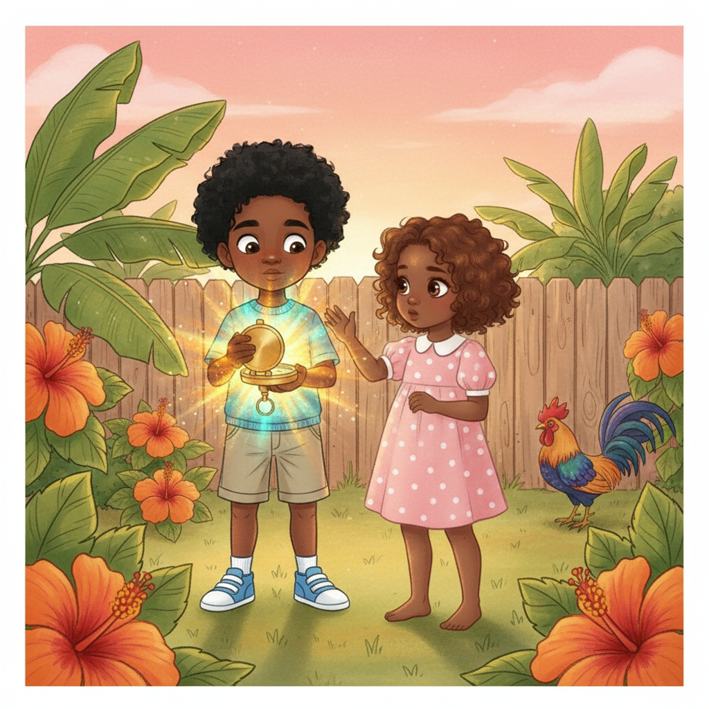

# Saint & Summer: The Island That Listens - Interactive Web Book



**Big hearts. Big dreams. Bigger world.**

An immersive, interactive web book experience for the multicultural children's book series "Saint & Summer: The Tall Kids' Adventures." This web application brings the story to life with clickable characters, interactive environmental elements, and a whimsical storybook aesthetic optimized for mobile and tablet devices.

## 🌟 Project Overview

Saint & Summer: The Island That Listens is the first book in a series grounded in psychological truth and emotional intelligence. This interactive web book transforms the traditional reading experience into an engaging, educational journey where children can:

- **Tap characters** to hear them speak through interactive speech bubbles
- **Discover hidden elements** in the environment with glowing animations
- **Navigate the story** with smooth page-turn animations and swipe gestures
- **Experience immersive design** with a whimsical color palette and custom animations
- **Export to PDF** for print-ready physical copies

## 📖 Story Synopsis

Join Saint and Summer on a magical adventure where they discover an ancient compass that transports them to a fantastical island. When Summer wanders off following a mysterious sound, Saint must learn that leadership isn't about having all the answers—it's about listening. Through their journey, the siblings navigate the four-stage arc of Wonder, Friction, Growth, and Harmony, ultimately discovering that quiet wisdom can light the way home.

## ✨ Key Features

### Interactive Elements
- **8 fully interactive story pages** with clickable hotspots
- **Character speech bubbles** triggered by tapping on characters
- **Environmental interactions** with animated glowing elements
- **Visual feedback** with pulsing rings and animations

### Navigation & UX
- **Swipe gesture support** for natural mobile/tablet navigation
- **Smooth page-turn animations** with directional transitions
- **Progress indicators** with interactive page dots
- **Fullscreen mode** for immersive reading experience
- **Welcome screen** with animated background elements

### Design & Aesthetics
- **Whimsical storybook theme** with custom color palette:
  - Golden Yellow (#FFD700) - Primary
  - Soft Pink (#FF9999) - Secondary
  - Vibrant Teal (#00CED1) - Accent
- **Custom animations**: float, pulse-glow, shimmer, wiggle
- **Responsive layouts** optimized for phone, tablet, and desktop
- **Dark mode support** for evening reading

### Export & Sharing
- **Print-ready PDF export** with professional formatting
- **High-quality image rendering** for physical printing
- **About/Credits page** with series information and mission

## 🎨 Creative Foundation

### The Four-Stage Sibling Arc
Every story follows a powerful emotional journey:
1. **Wonder** - Joint curiosity and shared discovery
2. **Friction** - Misunderstanding and conflict from different perspectives
3. **Growth** - Empathy and perspective-taking lead to repair
4. **Harmony** - Shared purpose and deeper connection emerge

### Psychological Grounding
- **Attachment Theory** - Secure base exploration
- **Emotional Intelligence** - Vocabulary for feelings
- **Cultural Curiosity** - Global citizenship and empathy
- **Four Intelligences** - EQ, CQ, IQ, GQ development

## 🚀 Technology Stack

- **Frontend Framework**: React 19
- **Styling**: Tailwind CSS 4 with custom theme
- **Animations**: Framer Motion
- **Gestures**: @use-gesture/react
- **PDF Generation**: jsPDF + html2canvas
- **UI Components**: shadcn/ui
- **Build Tool**: Vite
- **Typography**: Montserrat (headings), Quicksand (body)

## 📁 Project Structure

```
saint-summer-webbook/
├── client/
│   ├── public/
│   │   └── images/              # Story illustrations and character references
│   │       ├── 01_compass_glow.png
│   │       ├── 02_island_arrival.png
│   │       ├── 03_summer_wanders.png
│   │       ├── 04_listening_shells.png
│   │       ├── 05_singing_tree.png
│   │       ├── 06_helping_creature.png
│   │       ├── 07_path_of_light.png
│   │       ├── 08_return_home.png
│   │       ├── saint_reference.png
│   │       ├── summer_reference.png
│   │       └── ensemble_reference.png
│   ├── src/
│   │   ├── components/
│   │   │   ├── Book.tsx           # Main book component with navigation
│   │   │   ├── StoryPage.tsx      # Individual page with interactions
│   │   │   ├── WelcomeScreen.tsx  # Animated welcome screen
│   │   │   ├── AboutPage.tsx      # Credits and series info
│   │   │   └── ui/                # shadcn/ui components
│   │   ├── data/
│   │   │   └── storyContent.ts    # Story pages and interactive elements
│   │   ├── lib/
│   │   │   └── pdfExport.ts       # PDF generation utilities
│   │   ├── pages/
│   │   │   └── Home.tsx           # Main page component
│   │   ├── App.tsx                # App router
│   │   └── index.css              # Global styles and theme
│   └── index.html
├── README.md
└── todo.md
```

## 🎯 Interactive Elements Map

### Page 1: The Compass Glows
- **Saint** (30%, 40%) - "Look at this, Summer! The compass is glowing!"
- **Summer** (55%, 45%) - "It's so beautiful! What do you think it means?"
- **Compass** (45%, 60%) - Pulsing animation

### Page 2: Island Arrival
- **Saint** (25%, 50%) - "Everyone stay together. We need to explore this place carefully."
- **Summer** (42%, 52%) - "Do you hear that? It sounds like... singing?"
- **Jayden** (58%, 48%) - "My goggles are detecting some unusual energy patterns!"
- **Mushroom** (15%, 70%) - Glowing animation

### Page 3: Summer Wanders
- **Summer** (60%, 45%) - "The sound is coming from over there... I need to follow it!"
- **Forest** (30%, 30%) - Swaying animation
- **Bell Sound** (75%, 25%) - Ringing animation

### Page 4: Listening to Shells
- **Summer** (45%, 50%) - "If we listen carefully, the island will show us the way home."
- **Shell 1** (30%, 65%) - "Listen... listen... the island sings..."
- **Shell 2** (55%, 70%) - "Follow the song... follow the light..."

### Page 5: The Singing Tree
- **Saint** (35%, 55%) - "I understand now. Leadership isn't about having all the answers—it's about listening."
- **Summer** (52%, 57%) - "The tree has been singing to us all along!"
- **Tree** (40%, 20%) - Resonating animation

### Page 6: Helping the Creature
- **Saint** (30%, 50%) - "Everyone, let's work together. We can do this!"
- **Summer** (48%, 52%) - "Be gentle... the creature is scared."
- **Creature** (55%, 65%) - "Thank you, kind friends! Your compassion has freed me."

### Page 7: The Path of Light
- **Saint** (35%, 50%) - "You were right, Summer. Listening was the key all along."
- **Summer** (52%, 52%) - "And we did it together!"
- **Light Path** (45%, 30%) - Sparkling animation

### Page 8: Home Again
- **Saint** (38%, 48%) - "Every adventure teaches us something new. Today I learned to listen."
- **Summer** (56%, 50%) - "And I learned that my quiet voice matters too."
- **Compass** (47%, 65%) - Pulsing animation

## 🖼️ Image Assets

All illustrations are stored in `client/public/images/` and are also backed up to Google Drive:

### Story Illustrations (8 pages)
- `01_compass_glow.png` (1.6 MB) - Caribbean backyard, magical compass
- `02_island_arrival.png` (1.6 MB) - Six friends on fantastical island
- `03_summer_wanders.png` (1.7 MB) - Summer following mysterious sound
- `04_listening_shells.png` (1.4 MB) - Hidden cove with singing shells
- `05_singing_tree.png` (1.8 MB) - Ancient Banyan tree
- `06_helping_creature.png` (1.5 MB) - Teamwork to free creature
- `07_path_of_light.png` (1.7 MB) - Shimmering path home
- `08_return_home.png` (1.4 MB) - Sunset in Caribbean backyard

### Character References (3 files)
- `saint_reference.png` (1.2 MB) - Saint Germain character sheet
- `summer_reference.png` (1007 KB) - Summer Journey character sheet
- `ensemble_reference.png` (913 KB) - Supporting characters lineup

**Total Assets**: 11 files, ~16 MB

### Google Drive Backup
All image assets are backed up to Google Drive at:
https://drive.google.com/drive/folders/1miG7-pCciEJSbfB6GXNrkR5IRhBjEKCo?usp=sharing

## 🛠️ Installation & Setup

### Prerequisites
- Node.js 18+ 
- pnpm (recommended) or npm

### Installation

```bash
# Clone the repository
git clone https://github.com/[your-username]/saint-summer-webbook.git
cd saint-summer-webbook

# Install dependencies
pnpm install

# Start development server
pnpm dev
```

The app will be available at `http://localhost:3000`

### Build for Production

```bash
# Create production build
pnpm build

# Preview production build
pnpm preview
```

## 📱 Usage

1. **Welcome Screen**: Click "Begin the Adventure" to start
2. **Navigation**: 
   - Use Previous/Next buttons
   - Swipe left/right on touch devices
   - Click progress dots to jump to specific pages
3. **Interactions**: Tap glowing areas to trigger character speech and environmental effects
4. **Fullscreen**: Click the maximize icon for immersive reading
5. **About**: Click the info icon to learn about the series
6. **Export**: Click "Export PDF" to download a print-ready version

## 🎨 Customization

### Theme Colors
Edit `client/src/index.css` to customize the color palette:

```css
:root {
  --primary: oklch(0.75 0.15 85);     /* Golden yellow */
  --secondary: oklch(0.85 0.12 340);  /* Soft pink */
  --accent: oklch(0.65 0.18 195);     /* Vibrant teal */
}
```

### Story Content
Edit `client/src/data/storyContent.ts` to modify:
- Page text and titles
- Interactive element positions
- Character dialogue
- Animation types

## 🌐 Deployment

The project is configured for deployment on Manus platform. To deploy:

1. Save a checkpoint in the Manus interface
2. Click the "Publish" button in the Management UI
3. Configure your custom domain (optional)

For other platforms (Vercel, Netlify, etc.):

```bash
pnpm build
# Deploy the 'dist' folder
```

## 📄 License

This project is part of the Saint & Summer: The Tall Kids' Adventures series.
All story content, characters, and illustrations are proprietary.

## 🤝 Contributing

This is a proprietary project. For inquiries about the Saint & Summer series, please contact the creative team.

## 📞 Support

For technical issues or questions about the interactive web book, please open an issue in the GitHub repository.

## 🙏 Acknowledgments

- **Story & Concept**: Saint & Summer Creative Team
- **Illustrations**: AI-Generated with Creative Direction
- **Interactive Design**: Manus AI
- **Typography**: Montserrat & Quicksand (Google Fonts)

---

**Big hearts. Big dreams. Bigger world.**

*Saint & Summer: The Tall Kids' Adventures*
